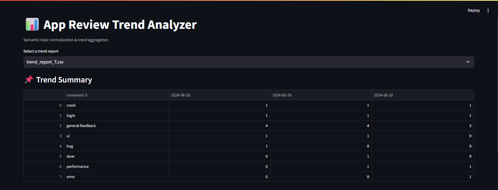
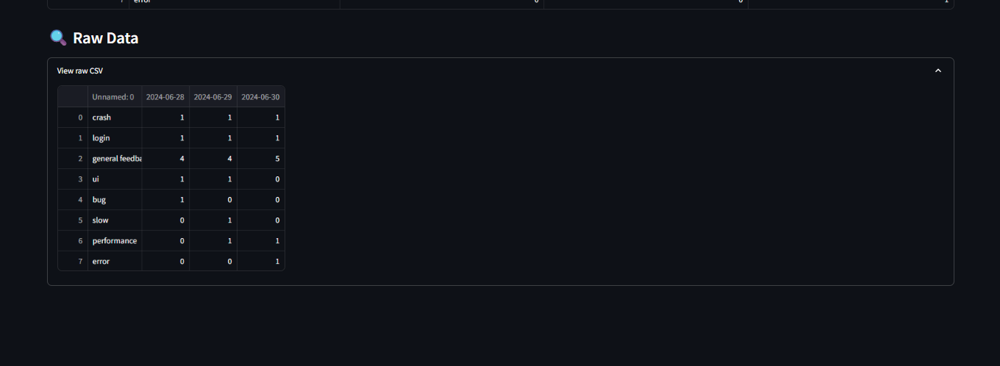
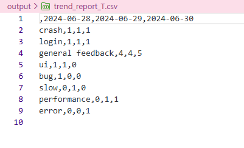

# App Review Topic Intelligence Pipeline

A reproducible AI pipeline for extracting, normalizing, and tracking user-reported issues from app reviews.
Designed for large-scale review analysis, product insight generation, and trend monitoring workflows.

## Overview

This project provides tools to:

 - Ingest daily app reviews (JSON format)

 - Extract meaningful user issues and topics from raw text

 - Normalize semantically similar topics into canonical forms

 - Maintain a persistent topic registry across runs

 - Track topic frequency trends over time

 - Output structured artifacts for downstream analysis and visualization

The system is modular, deterministic by default, and extensible to LLM-based extraction when API access is available.
---
## Screenshots
### Streamlit Dashboard






## Features

### Topic Extraction

 - Rule-based / deterministic fallback extraction

 - Optional LLM-based extraction (OpenAI-compatible)

 - Robust to missing API keys

 - Semantic Topic Normalization

 - Sentence-transformer embeddings

 - Cosine similarity–based clustering

 - Persistent topic registry for consistency across days

 - Trend Aggregation

 - Rolling aggregation of topic frequency

 - CSV-based output for reproducibility

 - Date-aware trend tracking

### Visualization

 - Lightweight Streamlit dashboard

 - Interactive trend exploration

## System Architecture
Reviews → Topic Extractor → Topic Normalizer → Trend Aggregator → CSV / Dashboard


Each stage is independently testable and replaceable.

## Repository Structure
```text
.
├── agents/
│   ├── topic_extractor.py
│   ├── topic_normalizer.py
│   └── trend_aggregator.py
│
├── data/                 # Daily review JSON files
├── memory/               # Persistent topic registry (runtime-generated)
├── output/               # Trend reports (runtime-generated)
│
├── dashboard.py          # Streamlit visualization
├── main.py               # Pipeline entrypoint
├── config.py             # Configuration parameters
├── requirements.txt
└── README.md
```
## Installation
```bash
git clone https://github.com/sheebanadeem/app-review-ai-agent.git
cd app-review-ai-agent

python -m venv .venv
source .venv/bin/activate   # macOS / Linux
.venv\Scripts\activate      # Windows

pip install -r requirements.txt
```
## Common dependencies include:
 - numpy
 - pandas
 - sentence-transformers
 - scikit-learn
 - streamlit
 - python-dotenv

## Usage
Command-line execution

Run the full analysis pipeline:
```bash
python main.py
```

This will:

 - Load daily reviews

 - Extract topics

 - Normalize them against existing registry

 - Generate a trend report CSV

## Dashboard

Launch the interactive dashboard:
```bash
streamlit run dashboard.py
```

The dashboard allows:

 - Topic-wise trend inspection

 - Date-based filtering

 - Quick qualitative analysis

## Python API
```bash
from agents.topic_extractor import extract_topics
from agents.topic_normalizer import normalize_or_create
from agents.trend_aggregator import update_trends

topics = extract_topics("App crashes frequently after update")
canonical = [normalize_or_create(t) for t in topics]S
update_trends(canonical, date="2024-06-30")
```
## Output Artifacts

output/trend_report.csv

 - Rows: canonical topics

 - Columns: dates

 - Values: frequency counts

 memory/topic_registry.json

 - Canonical topics

 - Embeddings for semantic matching

 - Persistent across runs

## Design Notes

 - Topic normalization is semantic, not string-based

 - System remains functional without external API keys

 - Registry-based memory ensures temporal consistency

 - Emphasis on reproducibility and explainability

## Evaluation Considerations

Possible evaluation metrics include:

 - Topic consistency across days

 - Reduction in duplicate topic variants

 - Coverage of user-reported issues

 - Trend signal stability over time

## Testing
```bash
pytest -q
```

Tests may include:

 - Topic normalization correctness

 - Registry persistence

 - Trend aggregation accuracy

## Future Extensions 

 - REST API for real-time ingestion

 - Sentiment-aware topic trends

 - Alerting for rapidly emerging issues

 - Database-backed persistence layer

## Author

 - Developed by Sheeba Nadeem.


